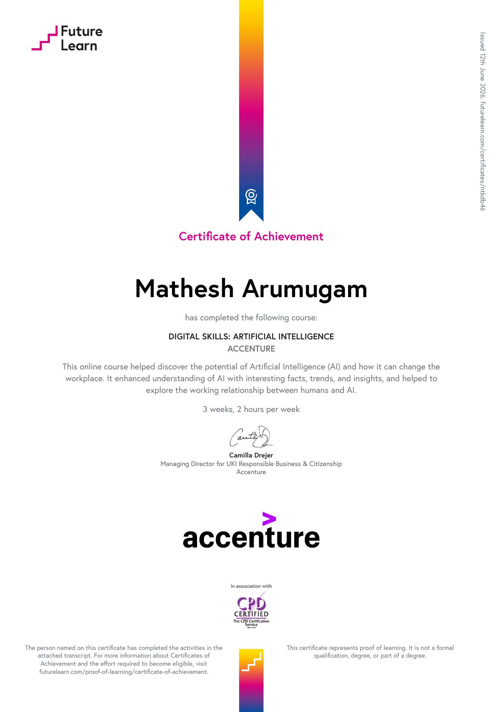
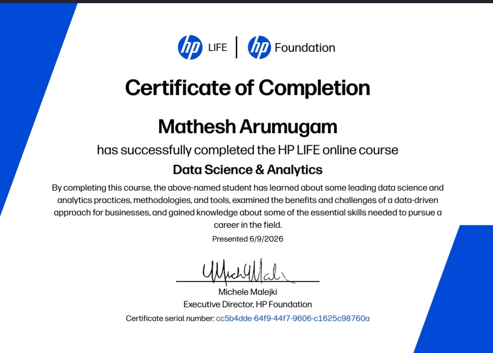
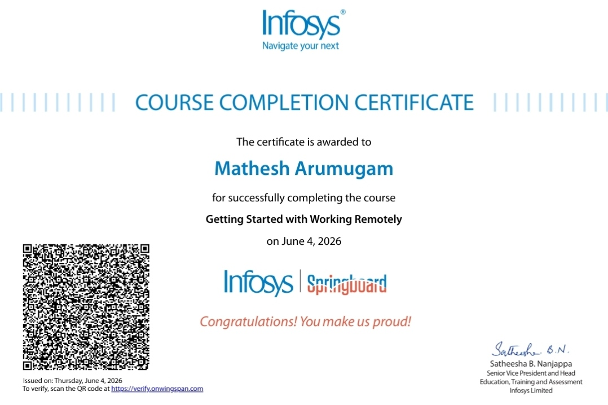

#👋 Hi, I'm Mathesh Arumugam

🎓 BE Computer Science Engineering  
🏛️ Sardar Raja College of Engineering  
💻 Java & Python Developer | AI Enthusiast

---

## 🛠️ Skills

---

## 🚀 Projects

- 🤖 **Candi AI** – AI-powered intelligent assistant built with Python
- 🎯 **Placement Portal** – Campus placement preparation question bank

---

## 🏆 Certifications

---

### 1. 🤖 Digital Skills: Artificial Intelligence

| | |
|---|---|
| 🏢 **Company** | Accenture (FutureLearn) |
| 📜 **Course** | Digital Skills: Artificial Intelligence |
| 📅 **Date** | June 12, 2026 |
| ⏱️ **Duration** | 3 weeks, 2 hours per week |
| 🎯 **Score** | 74% |
| 🔗 **Verify** | [Click here](https://futurelearn.com/certificates/ntkdb46) |

**Topics Covered:**
- Introduction to Artificial Intelligence & Generative AI
- Artificial Intelligence in Industry
- Adapting Skills to Work with AI

---

### 2. 📊 Data Science & Analytics

| | |
|---|---|
| 🏢 **Company** | HP LIFE Foundation |
| 📜 **Course** | Data Science & Analytics |
| 📅 **Date** | June 9, 2026 |
| 🔢 **Serial** | cc5b4dde-64f9-44f7-9606-c1625c98760a |
| ✍️ **Signed by** | Michele Malejki, Executive Director – HP Foundation |

**Topics Covered:**
- Data Science fundamentals and methodologies
- Analytics practices and tools
- Data-driven business approaches
- Essential skills for a career in Data Science

---

### 3. 💼 Getting Started with Working Remotely

| | |
|---|---|
| 🏢 **Company** | Infosys Springboard |
| 📜 **Course** | Getting Started with Working Remotely |
| 📅 **Date** | June 4, 2026 |
| ✍️ **Signed by** | Satheesha B. Nanjappa, SVP – Infosys Limited |
| 🔗 **Verify** | [Click here](https://verify.onwingspan.com) |

**Topics Covered:**
- Remote work best practices
- Digital collaboration tools
- Time management and productivity
- Effective communication in remote settings

---

## 🎓 Education

🏛️ **BE Computer Science Engineering**  
Sardar Raja College of Engineering, Tirunelveli  
2022 – 2026

---

## 🌐 Portfolio Website

👉 **[Click here to view my Portfolio](https://share.google/BOC2ZOCNx8ElmRkoQ)**

---

## 📫 Contact Me

